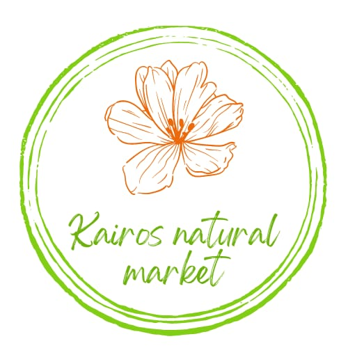

# 🌿 Kairos Natural Market

> **Página en construcción** - E-commerce de productos naturales



## 📋 Descripción

**Kairos Natural Market** es un e-commerce especializado en productos naturales que actualmente se encuentra en desarrollo. Estamos trabajando para brindarte una experiencia de compra natural, auténtica y sostenible.

### 🚀 Estado del Proyecto

- ✅ **Página de construcción** - Completada
- 🔄 **E-commerce completo** - En desarrollo
- 📅 **Lanzamiento** - Próximamente

## 🎨 Características de la Página Actual

### Diseño y Estética
- **Colores naturales**: Paleta cálida con beige suave (#E5EEE5), verde natural (#4C583C) y naranja cálido (#E67C30)
- **Tipografías elegantes**: Playfair Display (títulos) y Lato (texto)
- **Elementos decorativos**: Hojas y flores flotantes con animaciones suaves
- **Diseño responsive**: Optimizado para todos los dispositivos

### Funcionalidades
- ✨ **Animaciones suaves** con JavaScript
- 🌱 **Elementos naturales** que refuerzan la identidad de marca
- 📱 **Diseño responsive** y accesible
- 🎯 **SEO optimizado** con meta tags apropiados
- ♿ **Accesibilidad completa** (ARIA, contraste, navegación por teclado)

## 🛠️ Tecnologías Utilizadas

- **HTML5** - Estructura semántica y accesible
- **CSS3** - Estilos modernos con Flexbox y Grid
- **JavaScript (ES6+)** - Animaciones y efectos interactivos
- **Google Fonts** - Tipografías Playfair Display y Lato

## 📁 Estructura del Proyecto

```
kairos-en-construccion/
├── index.html          # Página principal
├── styles.css          # Estilos CSS
├── script.js           # JavaScript para animaciones
├── img/
│   ├── logooriginal2.jpg  # Logo principal
│   └── logo5.png          # Favicon
└── README.md           # Este archivo
```

## 🚀 Instalación y Uso

### Requisitos
- Navegador web moderno (Chrome, Firefox, Safari, Edge)
- Servidor web local (opcional, para desarrollo)

### Instalación
1. Clona el repositorio:
   ```bash
   git clone https://github.com/japintos/KairosMarket-construccion.git
   ```

2. Navega al directorio del proyecto:
   ```bash
   cd KairosMarket-construccion
   ```

3. Abre `index.html` en tu navegador o usa un servidor local:
   ```bash
   # Con Python
   python -m http.server 8000
   
   # Con Node.js (http-server)
   npx http-server
   ```

## 🎯 Próximas Funcionalidades

### E-commerce Completo
- 🛒 **Catálogo de productos** naturales y orgánicos
- 🛍️ **Carrito de compras** funcional
- 💳 **Sistema de pagos** integrado
- 👤 **Gestión de usuarios** y perfiles
- 📦 **Sistema de envíos** y seguimiento
- 📱 **App móvil** (futuro)

### Características Adicionales
- 🌱 **Blog de vida natural** y consejos
- 📧 **Newsletter** con ofertas especiales
- ⭐ **Sistema de reseñas** de productos
- 🎁 **Programa de fidelidad** y descuentos
- 📞 **Atención al cliente** 24/7

## 👨‍💻 Desarrollo

**Desarrollado por:** [WebXpert](https://www.webxpert.com.ar) - Julio Pintos

### Información del Desarrollador
- 🌐 **Sitio web**: [www.webxpert.com.ar](https://www.webxpert.com.ar)
- 👨‍💻 **Desarrollador**: Julio Pintos
- 📧 **Contacto**: Disponible a través del sitio web

## 📄 Licencia

© 2025 Kairos Natural Market. Todos los derechos reservados.

## 🤝 Contribuciones

Este proyecto está en desarrollo activo. Para contribuciones o sugerencias, por favor contacta a través de [WebXpert](https://www.webxpert.com.ar).

## 📞 Contacto

- **Empresa**: Kairos Natural Market
- **Desarrollo**: WebXpert - Julio Pintos
- **Sitio web**: [www.webxpert.com.ar](https://www.webxpert.com.ar)

---

*Estamos trabajando para brindarte una experiencia natural y auténtica. Volvé pronto.* 🌿✨
